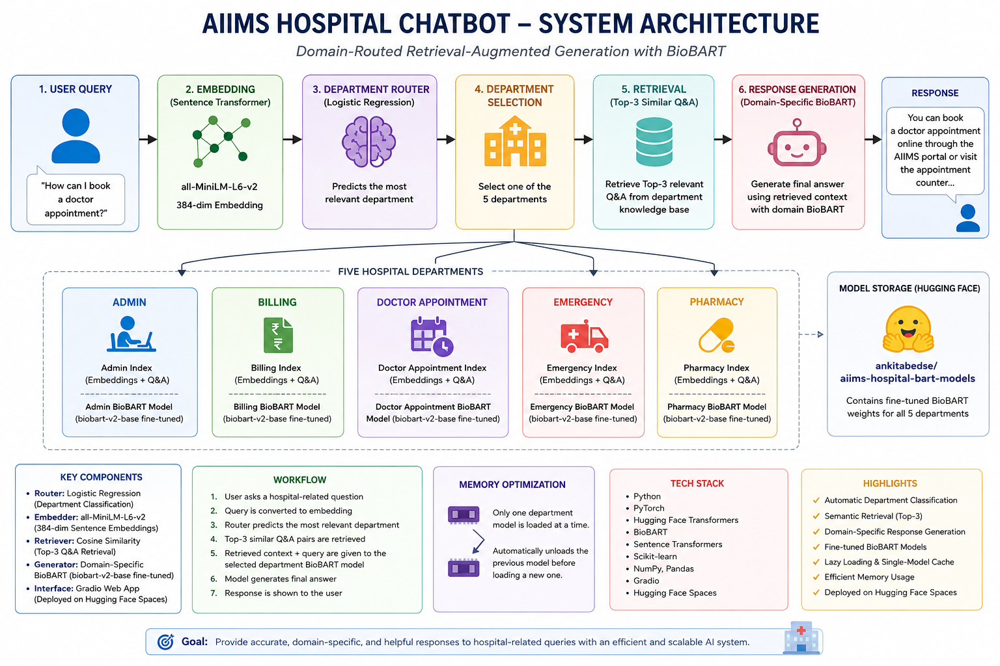

# 🏥 AIIMS Hospital Chatbot

An intelligent domain-routed hospital chatbot that combines department classification, semantic retrieval, and five domain-specific fine-tuned BioBART models to generate contextual responses for hospital-related queries.

## 🚀 Live Demo

**Hugging Face Space:**  
https://huggingface.co/spaces/ankitabedse/aiims-hospital-chatbot

**Trained Model Repository:**  
https://huggingface.co/ankitabedse/aiims-hospital-bart-models

---

## 🏗️ System Architecture



### End-to-End Pipeline

```text
User Query
    ↓
Sentence Transformer
(all-MiniLM-L6-v2)
    ↓
Logistic Regression Router
    ↓
Department Selection
    ↓
Top-3 Semantic Retrieval
    ↓
Domain-Specific BioBART
    ↓
Final Hospital Response
```

## 🧠 How the System Works

### 1. User Query
The user enters a hospital-related question through the Gradio web interface.

### 2. Query Embedding
The query is converted into a 384-dimensional sentence embedding using `all-MiniLM-L6-v2`.

### 3. Department Routing
A Logistic Regression classifier predicts the most relevant hospital department:

- Admin
- Billing
- Doctor Appointment
- Emergency
- Pharmacy

### 4. Semantic Retrieval
After routing, the query is compared with the selected department's embedding index using cosine similarity. The system retrieves the **top 3 most relevant Q&A records**.

### 5. Response Generation
The retrieved context and the user's question are combined into a prompt and passed to the corresponding fine-tuned BioBART model.

Each department has its own trained model:

```text
Admin              → admin_biobart_weights.pt
Billing            → billing_biobart_weights.pt
Doctor Appointment → da_biobart_weights.pt
Emergency          → emergency_biobart_weights.pt
Pharmacy           → pharma_biobart_weights.pt
```

## 🎯 Key Features

- Automatic hospital department classification
- Semantic search using sentence embeddings
- Top-3 contextual Q&A retrieval
- Five domain-specific fine-tuned BioBART models
- Lazy loading of department models
- Single-domain model cache for memory efficiency
- Automatic model download from Hugging Face
- Local and cloud-compatible path handling
- Gradio web interface
- Hugging Face Spaces deployment

## 🧩 Memory Optimization

The chatbot does **not keep all five large BioBART models in memory simultaneously**.

Instead, it maintains a single active department model:

```text
Admin Question
    ↓
Load Admin BioBART
    ↓
Admin remains cached

Billing Question
    ↓
Unload Admin
    ↓
Load Billing BioBART
```

This controlled caching approach reduces memory usage and is useful for constrained deployment environments.

## 🛠️ Tech Stack

| Component | Technology |
|---|---|
| Programming | Python |
| Deep Learning | PyTorch |
| NLP Framework | Hugging Face Transformers |
| Generative Model | BioBART |
| Embeddings | Sentence Transformers |
| Router | Scikit-learn Logistic Regression |
| Retrieval | Cosine Similarity |
| Data Processing | NumPy, Pandas |
| UI | Gradio |
| Deployment | Hugging Face Spaces |
| Model Hosting | Hugging Face Model Hub |

## 📁 Project Structure

```text
AIIMSMicromodel/
│
├── app.py
├── main.py
├── chatbot.py
├── model_loader.py
├── retriever.py
├── requirements.txt
├── README.md
├── architecture.png
│
├── Datasets/
│
├── models/
│   ├── router/
│   ├── admin/
│   ├── billing/
│   ├── doctor_appointment/
│   ├── emergency/
│   └── pharmacy/
│
└── hospital_chatbot_models/
```

> The large fine-tuned BioBART `.pt` files are stored separately in the Hugging Face Model Hub rather than committed to the application repository.

## 💾 Model Hosting

**Hugging Face Model Repository**

https://huggingface.co/ankitabedse/aiims-hospital-bart-models

Expected structure:

```text
aiims-hospital-bart-models/
├── admin/
│   └── admin_biobart_weights.pt
├── billing/
│   └── billing_biobart_weights.pt
├── doctor_appointment/
│   └── da_biobart_weights.pt
├── emergency/
│   └── emergency_biobart_weights.pt
└── pharmacy/
    └── pharma_biobart_weights.pt
```

The application first checks for a local model file. If it is not available, it downloads the required department model from the Hugging Face repository.

## 💻 Local Setup

### 1. Clone the repository

```bash
git clone <YOUR-GITHUB-REPOSITORY-URL>
cd AIIMSMicromodel
```

### 2. Create a virtual environment

Windows:

```powershell
python -m venv .venv
```

Activate it:

```powershell
.venv\Scriptsctivate
```

### 3. Install dependencies

```powershell
pip install -r requirements.txt
```

### 4. Run the desktop application

```powershell
python main.py
```

### 5. Run the Gradio web application

```powershell
python app.py
```

The local web interface will be available at:

```text
http://127.0.0.1:7860
```

## 🌐 Deployment

The web application is deployed using **Hugging Face Spaces + Gradio**.

```text
Browser
   ↓
Gradio Web App
   ↓
HospitalChatbot
   ↓
Department Router
   ↓
Semantic Retrieval
   ↓
Domain-Specific BioBART
   ↓
Response
```

Large model artifacts are kept separately in the Hugging Face Model Hub so that the application source repository remains lightweight.

## 📊 Supported Departments

| Department | Retrieval Index | Fine-Tuned Model |
|---|---|---|
| Admin | Admin embeddings + Q&A | Admin BioBART |
| Billing | Billing embeddings + Q&A | Billing BioBART |
| Doctor Appointment | Doctor Appointment embeddings + Q&A | Doctor Appointment BioBART |
| Emergency | Emergency embeddings + Q&A | Emergency BioBART |
| Pharmacy | Pharmacy embeddings + Q&A | Pharmacy BioBART |

## 🔮 Future Improvements

- Conversation history and multi-turn memory
- Confidence score for department routing
- Authentication and user management
- Better monitoring and logging
- Additional hospital departments
- Automated response evaluation
- FastAPI backend for API-based deployment
- Production-grade model serving and observability

## 👩‍💻 Project Highlights

This project demonstrates:

- Domain-specific NLP model design
- Multi-stage NLP inference pipelines
- Semantic retrieval
- Fine-tuned transformer models
- Memory-aware model serving
- Model artifact management
- Cloud deployment with Hugging Face Spaces
- Separation of application code and large ML model artifacts
